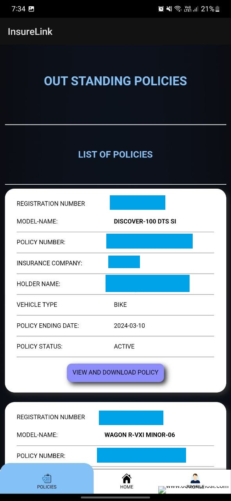
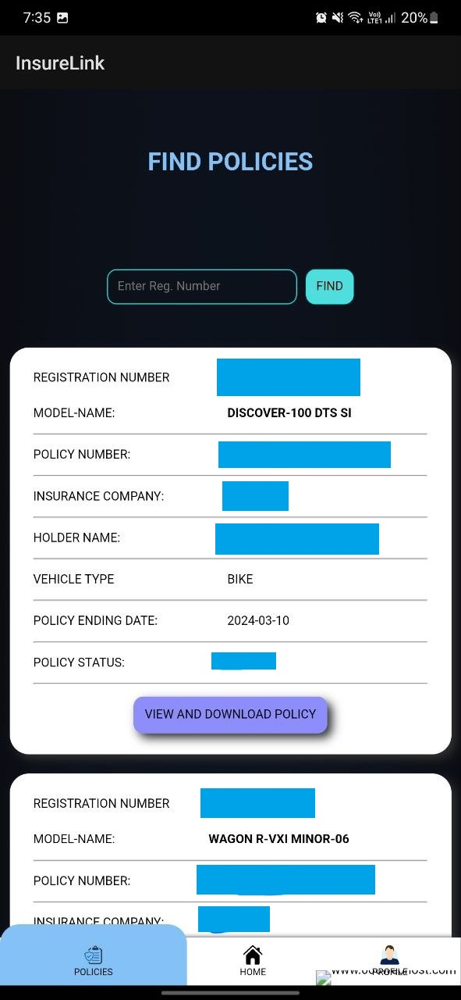

<!-- PROJECT LOGO -->
 

  

  <h3 align="center">InsureLink: Tracking Made Easy</h3>

  

   Implement a GIC CRM system to enhance customer relationship management for our general insurance business

<!-- TABLE OF CONTENTS -->

  
Table of Contents

  <ol>
    <li>
      <a href="#about-the-project">About The Project</a>
      <ul>
        <li><a href="#built-with">Built With</a></li>
      </ul>
    </li>
    <li><a href="#snapshots">Snapshots</a></li>
    <li><a href="#contact">Contact</a></li>
  </ol>

<!-- ABOUT THE PROJECT -->
## About The Project

   
**Project:** Implement a GIC CRM system to enhance customer relationship management for our general insurance business.

**Goals:**

-   **Centralize customer data**  for a unified view and improved understanding.
-   **Streamline lead management**  to prioritize high-potential prospects and increase sales efficiency.
-   **Enhance communication and collaboration**  between sales and marketing teams for a synchronized customer approach.

(<a href="#readme-top">back to top</a>)

### Built With

GIC-CRM is made up with following technology

 - HTML
 - CSS
 - JAVASCRIPT
 - PHP
 - MYSQL

(<a href="#readme-top">back to top</a>)

## Snapshots

(<a href="#readme-top">back to top</a>)

<!-- CONTACT -->
## Contact

Your Name - [@Nitin_Kumawat](www.linkedin.com/in/nitin-kumawat-957160261) - Nitin.kumawat.cs.8000@gmail.com

Project Link: [https://github.com/mr-nitin8000/GIC-CRM](https://github.com/mr-nitin8000/GIC-CRM)

(<a href="#readme-top">back to top</a>)

